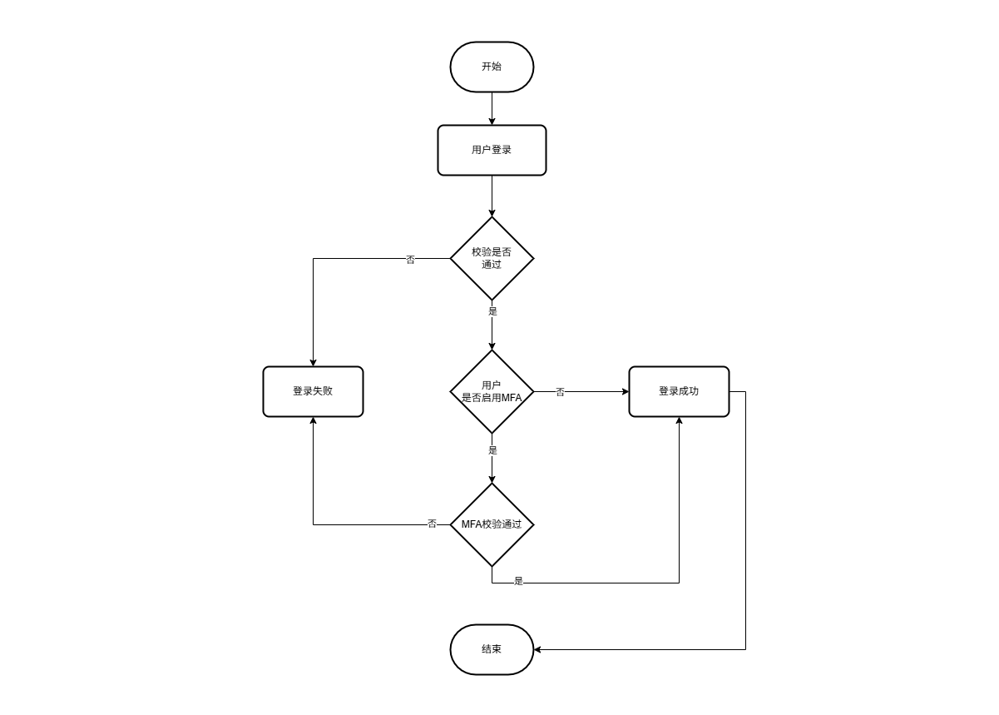

# 权限认证

## 登录流程

用户登录时，先校验账号密码，若不通过则登录失败；若通过且未启用 MFA 则直接登录成功，若启用 MFA 则需完成二次校验，校验通过则登录成功、不通过则登录失败。



---

## 登录接口

通过用户名和密码登录

```http
POST /api/v1/auth/login
```

**认证**：无需认证

**请求体参数**：

| 字段名   | 类型   | 必填 | 默认值 | 描述   |
| :------- | :----- | :--- | :----- | :----- |
| username | 字符串 | 是   | -      | 用户名 |
| password | 字符串 | 是   | -      | 密码   |

**请求示例**：

```http
POST /api/v1/auth/login HTTP/1.1
Content-Type: application/json

{
	"username": "admin",
	"password": "admin"
}
```

**响应示例**：

如果验证成功，且对应的用户没有启用MFA则会返回如下结果

```http
HTTP/1.1 200 OK
Content-Type: application/json

{
	"success": true,
	"code": 200,
	"message": "认证成功（建议启用MFA）",
	"data": {
		"status": "authorized",
		"token": "<JWT_TOKEN>"
	},
	"meta": {}
}
```

如果用户启用了MFA，则会返回下面这种结果，包含一个挑战id，客户端需要携带挑战id去进行MFA认证

> [!NOTE]
>
> 挑战ID有效期为120秒，最多只能重试5此，且验证成功后会立即销毁

```http
HTTP/1.1 200 OK
Content-Type: application/json

{
	"success": true,
	"code": 200,
	"message": "",
	"data": {
		"status": "needMFA",
		"challengeId": "<CHALLENGE_ID>"
	},
	"meta": {}
}
```

如果验证失败，会响应如下结果

```http
HTTP/1.1 401 OK
Content-Type: application/json

{
	"success": false,
	"code": 401,
	"message": "认证失败",
	"data": null,
	"meta": {},
	"errorCode": "auth.authentication_failed",
	"traceId": "1779690873-fbcb11ab52b7660c"
}
```

**接口错误代码**：

| 错误码 | 错误描述 |
| :---- | :------- |
| `auth.authentication_failed` | 认证失败 |
| `auth.find_admin_failed` | 查找管理员时出错 |
| `auth.validate_password_failed` | 密码校验异常 |
| `auth.mfa.create_challenge_failed` | 创建MFA挑战时出错 |
| `auth.token.generate_failed` | 生成token时出错 |

---

## MFA验证接口(TOTP)

通过用户名和密码登录

```http
POST /api/v1/auth/mfa/totp
```

**认证**：无需认证

**请求体参数**：

| 字段名      | 类型   | 必填 | 默认值 | 描述       |
| :---------- | :----- | :--- | :----- | :--------- |
| challengeId | 字符串 | 是   | -      | 挑战ID     |
| otp         | 字符串 | 是   | -      | 一次性密码 |

**请求示例**：

```http
POST /api/v1/auth/mfa/totp HTTP/1.1
Content-Type: application/json

{
    "challengeId":"BO97oa3wxxfuQeKxzsmmH9Ym",
    "otp":"750629"
}
```

**响应示例**：

若验证成功，则会返回一下结果

```http
HTTP/1.1 200 OK
Content-Type: application/json

{
	"success": true,
	"code": 200,
	"message": "",
	"data": {
		"token": "<JWT_TOKEN>"
	},
	"meta": {}
}
```

认证失败则为

```http
HTTP/1.1 401 OK
Content-Type: application/json

{
	"success": false,
	"code": 401,
	"message": "认证失败",
	"data": null,
	"meta": {},
	"errorCode": "auth.authentication_failed",
	"traceId": "1779692747-166d56d0f8e2dc23"
}
```

挑战id无效或者失效则为

```http
HTTP/1.1 401 OK
Content-Type: application/json

{
	"success": false,
	"code": 400,
	"message": "无效的MFA挑战",
	"data": null,
	"meta": {},
	"errorCode": "auth.mfa.invalid_challenge",
	"traceId": "1779692883-10abfda60a7ad0d4"
}
```
**接口错误代码：**

| 错误码 | 错误描述 |
| :---- | :------- |
| auth.mfa.get_challenge_failed | 获取MFA挑战时出错 |
| auth.mfa.invalid_challenge | 无效的MFA挑战 |
| auth.find_admin_failed | 查找管理员时出错 |
| auth.authentication_failed | 认证失败 |
| auth.mfa.clean_challenge_failed | 清除MFA挑战时出错 |
| auth.token.generate_failed | 生成token时出错 |


