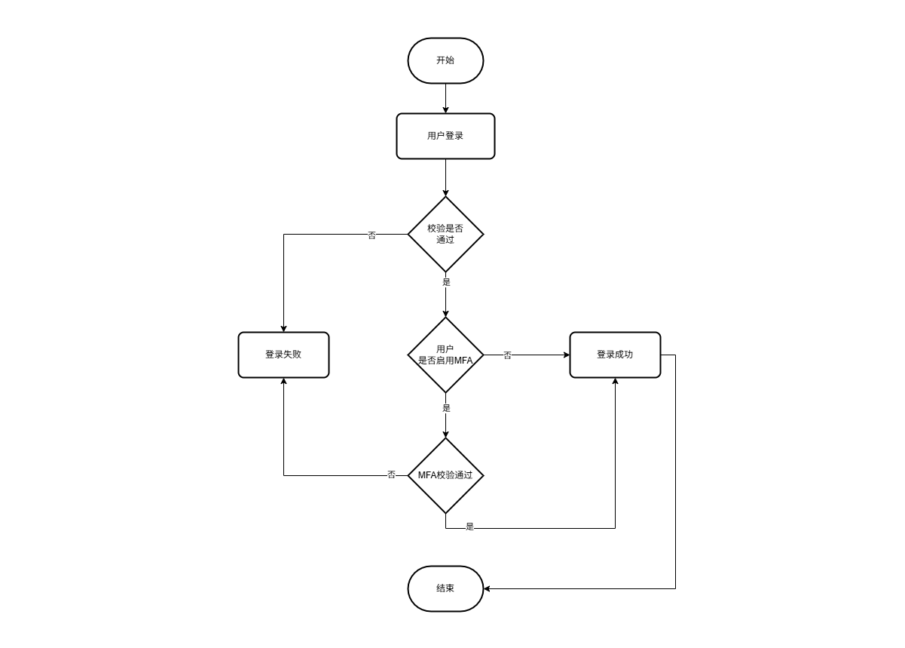

# 权限认证

## 登录流程

用户登录时，先校验账号密码，若不通过则登录失败；若通过且未启用 MFA 则直接登录成功，若启用 MFA 则需完成二次校验，校验通过则登录成功、不通过则登录失败。



---

## 登录接口

通过用户名和密码登录

```
POST /api/v1/auth/login
```

**认证**：无需认证

**请求体参数**：

| 字段名     | 类型   | 必填 | 描述   |
| :--------- | :----- | :--- | :----- |
| username   | 字符串 | 是   | 用户名 |
| password   | 字符串 | 是   | 密码   |

**请求示例**：

```http
POST /api/v1/auth/login HTTP/1.1
Content-Type: application/json

{
  "username": "admin",
  "password": "admin"
}
```

**响应示例**：

验证成功且未启用 MFA 时返回：

```http
HTTP/1.1 200 OK
Content-Type: application/json

{
  "success": true,
  "code": 200,
  "message": "认证成功（建议启用MFA）",
  "data": {
    "status": "authorized",
    "token": "<JWT_TOKEN>"
  },
  "meta": {}
}
```

验证成功但已启用 MFA 时返回 challengeId，客户端需携带它去进行二次验证：

> [!NOTE]
> 挑战 ID 有效期为 120 秒，最多可重试 5 次，验证成功后立即销毁。

```http
HTTP/1.1 200 OK
Content-Type: application/json

{
  "success": true,
  "code": 200,
  "message": "",
  "data": {
    "status": "needMFA",
    "challengeId": "<CHALLENGE_ID>"
  },
  "meta": {}
}
```

认证失败时返回：

```http
HTTP/1.1 401 Unauthorized
Content-Type: application/json

{
  "success": false,
  "code": 401,
  "message": "认证失败",
  "data": null,
  "meta": {},
  "errorCode": "auth.authentication_failed",
  "traceId": "1779690873-fbcb11ab52b7660c"
}
```

**接口错误代码**：

| 错误码 | 错误描述 |
| :---- | :------- |
| `auth.authentication_failed` | 认证失败 |
| `auth.find_admin_failed` | 查找管理员时出错 |
| `auth.validate_password_failed` | 密码校验异常 |
| `auth.mfa.create_challenge_failed` | 创建 MFA 挑战时出错 |
| `auth.token.generate_failed` | 生成 Token 时出错 |

---

## MFA 验证接口（TOTP）

使用 TOTP 验证码完成二次认证。

```
POST /api/v1/auth/mfa/totp
```

**认证**：无需认证

**请求体参数**：

| 字段名      | 类型   | 必填 | 描述         |
| :---------- | :----- | :--- | :----------- |
| challengeId | 字符串 | 是   | 挑战 ID      |
| otp         | 字符串 | 是   | 一次性验证码 |

**请求示例**：

```http
POST /api/v1/auth/mfa/totp HTTP/1.1
Content-Type: application/json

{
  "challengeId": "BO97oa3wxxfuQeKxzsmmH9Ym",
  "otp": "750629"
}
```

**响应示例**：

验证成功：

```http
HTTP/1.1 200 OK
Content-Type: application/json

{
  "success": true,
  "code": 200,
  "message": "",
  "data": {
    "token": "<JWT_TOKEN>"
  },
  "meta": {}
}
```

验证码错误或 challenge 过期：

```http
HTTP/1.1 401 Unauthorized
Content-Type: application/json

{
  "success": false,
  "code": 401,
  "message": "认证失败",
  "data": null,
  "meta": {},
  "errorCode": "auth.authentication_failed",
  "traceId": "1779692747-166d56d0f8e2dc23"
}
```

Challenge 无效（不存在、已过期或达到最大重试次数）：

```http
HTTP/1.1 400 Bad Request
Content-Type: application/json

{
  "success": false,
  "code": 400,
  "message": "无效的MFA挑战",
  "data": null,
  "meta": {},
  "errorCode": "auth.mfa.invalid_challenge",
  "traceId": "1779692883-10abfda60a7ad0d4"
}
```

**接口错误代码**：

| 错误码 | 错误描述 |
| :---- | :------- |
| `auth.mfa.get_challenge_failed` | 获取 MFA 挑战时出错 |
| `auth.mfa.invalid_challenge` | 无效的 MFA 挑战 |
| `auth.find_admin_failed` | 查找管理员时出错 |
| `auth.authentication_failed` | 认证失败（验证码错误） |
| `auth.mfa.clean_challenge_failed` | 清除 MFA 挑战时出错 |
| `auth.token.generate_failed` | 生成 Token 时出错 |

---

## 登出接口

吊销当前 JWT Token，使其立即失效。

```
POST /api/v1/auth/logout
```

**认证**：需要 JWT 认证（请求头 `Authorization: Bearer <token>`）

**请求示例**：

```http
POST /api/v1/auth/logout HTTP/1.1
Authorization: Bearer <token>
```

**响应示例**：

```json
HTTP/1.1 200 OK
Content-Type: application/json

{
  "success": true,
  "code": 200,
  "message": "",
  "data": null,
  "meta": {}
}
```

**接口错误代码**：

| 错误码 | 错误描述 |
| :---- | :------- |
| `auth.token.revoke_failed` | 注销 Token 时出错 |
